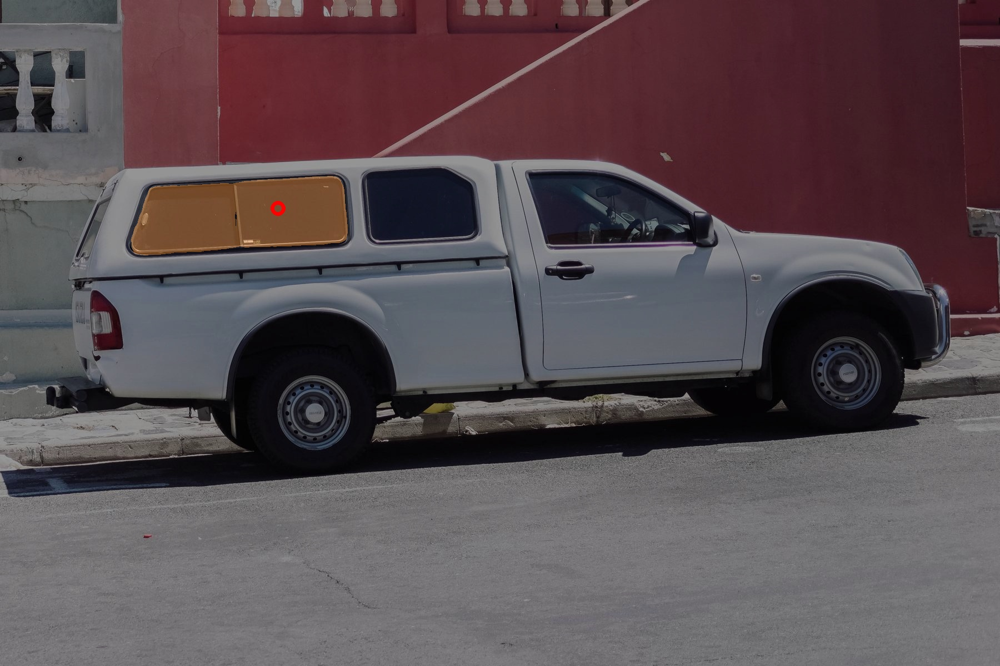

# EdgeSAM-MNN
One MNN deployment of EdgeSAM
Prompt-In-the-Loop Distillation for On-Device Deployment of SAM
https://github.com/chongzhou96/EdgeSAM

## python 
Run:
```bash
cd mnn_python
python segment_anything_example.py
```

## cpp
Prapare MNN OpenCV lib as in CMakeList.txt, make:

```bash
mkdir build; cd build
cmake ..
make
```
Run:
```bash
./sam_demo ../../edgeSAM_encoder.mnn ../../edgeSAM_decoder.mnn ../../resource/truck.jpg
```

## result

